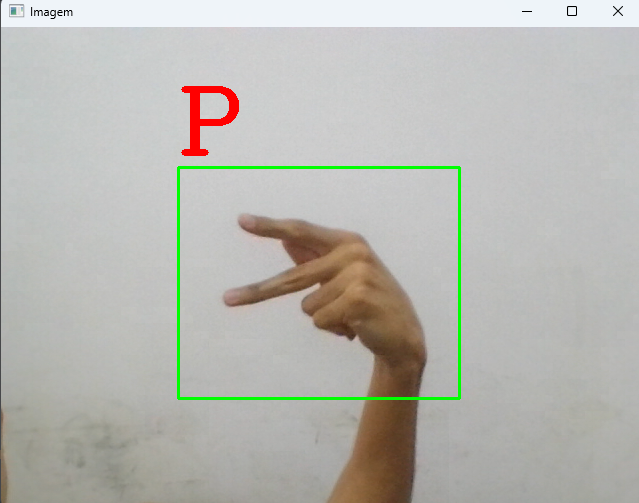
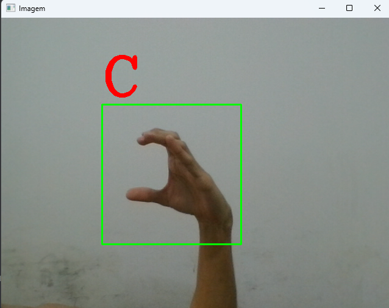

# Brazilian Sign Language Alphabet Recognition - Artificial Intelligence Project

## Concept

A project aimed at recognizing Brazilian Sign Language alphabet signs through gestures captured by the webcam.

## How to Use
- After downloading all the files, install the dependencies with "pip install -r requirements.txt". After that, simply enter this command to start the program directly in the terminal: "python main.py".
- Make hand signs and the program will display the detected letters in real-time on the screen.

## Resources Used

The model was created using Google's Teachable Machine and the program was developed using Python and the following libraries:
- OpenCV - video capture and manipulation;
- MediaPipe - hand processing;
- Keras - AI model;
- NumPy - numerical representation of data.

## Known Issues

- Due to the use of static images to recognize gestures, it was necessary to use static representation for signs that include movements.
- The program works more effectively with a smooth background.
- Some signs have significantly lower success rate than others, as shown in the following graph:

## Authors

- [Guilherme Bortoletto](https://github.com/guilherme-bortoletto)
- [Ryan Sakurai](https://github.com/ryansakurai)
- [Vinicius Castro](https://github.com/vinciuscastro)
- [Marcelo Pirro](https://github.com/marcelopirro)
- [Caike dos Santos](https://github.com/CaikeSantos)

(Computer Science students at UFSCAR - Federal University of São Carlos)
